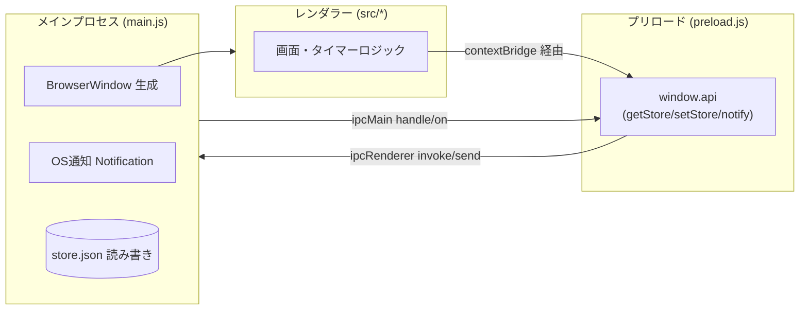
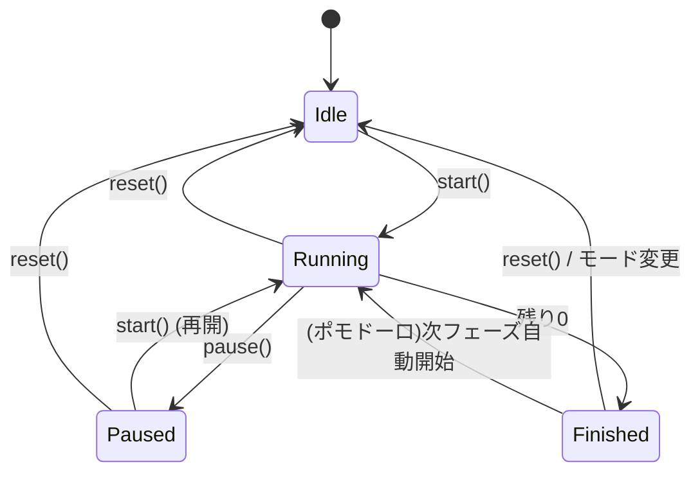
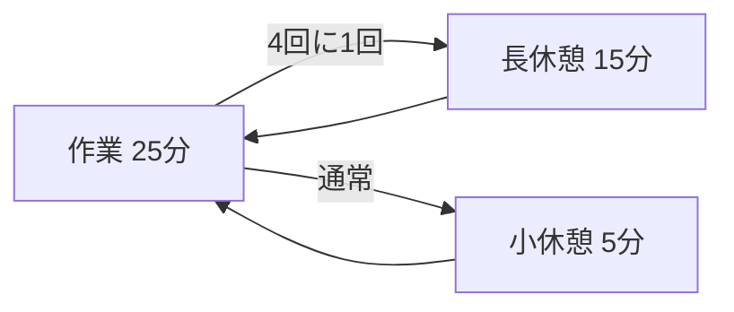

# Time & To-Do 技術設計資料

最終更新: 2026-09-14 / 対象バージョン: 0.2.0

---

## 1. 概要

タイマー機能を中心にしたデスクトップアプリ。カウントダウン・ポモドーロ・時刻指定
（目標時刻までのカウントダウン）に加え、基本的な To-Do（追加/完了/削除/永続化）を備える。
今後はタイマーと To-Do の連携などを進める。本資料は実装済みの設計と、今後の拡張方針をまとめる。

### 1.1 ゴール / 非ゴール

**ゴール**
- Windows でダブルクリック起動できる軽量なタイマーアプリ
- 残り時間が直感的に分かる視覚表現（円形リング）
- タイマーと To-Do を同一アプリ内でシームレスに扱える土台

**非ゴール（現時点）**
- クラウド同期・アカウント機能
- モバイル対応
- 複数タイマーの同時実行

---

## 2. 技術スタックと選定理由

| 項目 | 採用 | 理由 |
|---|---|---|
| ランタイム | Electron 38 | Node.js が導入済み。HTML/CSS/JS で UI を書け、OS通知・ファイル保存が容易 |
| 言語 | 素の JavaScript | 小規模のため。ビルド工程（TS/バンドラ）を挟まず保守を単純化 |
| パッケージング | electron-builder 25 | nsis インストーラーと portable exe を同時生成できる |
| 永続化 | JSON ファイル | 小さなデータ量。DB を導入せず `userData/store.json` に直接保存 |

**Tauri を採用しなかった理由**: Rust ツールチェーンが未導入で、導入コストが高いため。
将来アプリが大きくなり配布サイズ（現状 約90MB）が問題になれば再検討の余地あり。

---

## 3. アーキテクチャ

Electron の標準的な3層構成（メイン / プリロード / レンダラー）を採用し、
セキュリティのため `contextIsolation: true` / `nodeIntegration: false` とする。



### 3.1 プロセス間通信（IPC）

レンダラーは Node.js API に直接触れず、プリロードが公開する `window.api` のみを使う。

| チャンネル | 種別 | 方向 | 用途 |
|---|---|---|---|
| `store:get` | invoke/handle | R → M → R | 保存データの取得 |
| `store:set` | invoke/handle | R → M → R | 保存データの書き込み |
| `notify`    | send/on       | R → M     | OS通知の発火（title/body） |

> 現状、`store:get` / `store:set` は実装済みだがレンダラーからは未使用。
> **To-Do 機能で使う永続化レイヤーとして先行して用意している。**

---

## 4. ディレクトリ構成

```
time-todo/
├─ main.js            # メインプロセス：ウィンドウ・IPC・通知・保存
├─ preload.js         # 安全なAPIブリッジ（contextBridge）
├─ src/
│  ├─ index.html      # 画面レイアウト（タブUI）
│  ├─ renderer.js     # タイマーの状態管理とロジック
│  └─ style.css       # スタイル（円形リング含む）
├─ docs/
│  └─ DESIGN.md       # 本資料
├─ package.json       # 依存・スクリプト・electron-builder 設定
├─ README.md
├─ LICENSE            # MIT
└─ .gitignore         # node_modules / dist などを除外
```

---

## 5. タイマーの設計

### 5.1 状態モデル（モードごとに独立・同時稼働）

3つのモード（countdown / pomodoro / target）は**それぞれ独立した状態**を持ち、
**同時に稼働**できる。`mode` は「今表示しているモード」を指すだけで、切り替えても他は止まらない。

```js
const S = {
  countdown: { durationMs, remainingMs, endTime, running },
  pomodoro:  { durationMs, remainingMs, endTime, running, phase, completedPomos },
  target:    { durationMs, remainingMs, endTime, running, targetTimestamp },
};
let mode = 'countdown'; // 表示中のモード
```

- **共通ティッカー**：`tickAll()` を1本の `setInterval`(100ms)で回し、稼働中の全モードの
  `remainingMs = endTime - now` を更新。0以下になったモードは `finishMode(m)` を実行（表示中で
  なくても音・通知は出る）。全モードが停止したらティッカーを止める（`ensureTicker`/`anyRunning`）。
- `start` / `pause` / `reset` は**現在表示中のモード**にのみ作用。モード切替ボタンは表示を変える
  だけ。稼働中のモードはボタンに緑のドット（`.is-running`）で示す。
- 各フィールドの意味：`durationMs`=総時間（リングの分母）、`remainingMs`=残り、
  `endTime`=終了時刻のタイムスタンプ、`running`=稼働中、`phase`/`completedPomos`=ポモドーロ用、
  `targetTimestamp`=目標時刻。

### 5.2 ドリフト対策（重要な設計判断）

`setInterval` の発火回数を数えて減算すると、タブ非アクティブ時などに誤差が蓄積する。
そこで **開始時に終了時刻 `endTime = Date.now() + remainingMs` を確定**し、
毎フレーム `remainingMs = endTime - Date.now()` で「今の残り」を再計算する。
`setInterval` は 200ms 間隔で「再描画のトリガー」としてのみ使い、時間の真実は常に時計から得る。

### 5.3 状態遷移



### 5.4 カウントダウン

- 入力は **時 / 分 / 秒**。上限 **12時間**（`MAX_MS = 12*60*60*1000`）を超える指定は自動で頭打ち。
- プリセット（1分〜3時間）は「秒数」を `data-sec` で持ち、入力欄へ反映してから確定する。
- 表示は1時間以上で `HH:MM:SS`、未満で `MM:SS`（`fmt()` が切替）。

### 5.4.1 時刻指定（目標時刻までのカウントダウン）

- `<input type="time">` で目標時刻(HH:MM)を指定。指定時刻が現在より前なら**翌日**として扱う。
- `applyTarget()` が目標時刻のタイムスタンプ `targetTimestamp` を算出し、
  `remainingMs = durationMs = targetTimestamp - Date.now()` を設定（総リングの基準は設定〜目標の全長）。
- `start()` では `endTime = targetTimestamp` に直接ロックし、セット〜開始間の経過も含めて
  実時刻に正確に合わせる。終了時は「指定時刻になりました」を通知。
- 設定した目標時刻(HH:MM)は `store.lastTargetTime` に保存し、次回起動時の初期値に復元する
  （保存が無ければ現在+1時間）。
- このモードでは総合時間の円（総リング）と凡例の「総」を非表示にし、時/分/秒のみ表示する
  （`#tab-timer` に `no-total` クラスを付与）。
- カウントダウン表示の下に現在日時を小さく表示（`updateClock` を1秒間隔で更新。このモードのみ）。
- 逆にカウントダウン/ポモドーロでは総リングのみ表示し、時/分/秒を隠す（`only-total` クラス）。

### 5.5 ポモドーロ

- 定数 `POMO = { work:25, shortBreak:5, longBreak:15, longEvery:4 }`（分）。
- `finish()` で作業→休憩→作業…と自動巡回。作業を `longEvery`(4) 回終えるごとに長休憩。
- フェーズ切替後は `start()` を呼び、次フェーズを自動開始する。



### 5.5.1 毎正時チャイム

- ON にすると毎時 XX:00 に音（`beep`）と通知を出す（`store.chimeEnabled` に保存、起動時復元）。
- `msToNextHour()` で次の正時までの ms を求め、`setTimeout` で予約 → 発火時に再計算して連鎖
  （`setInterval` を使わずドリフトを避ける。スリープ復帰時も次回発火で再整合）。
- タイマー本体とは独立。音を確実に鳴らすため main の `webPreferences.autoplayPolicy` を
  `'no-user-gesture-required'` に設定。
- チェックボックスは「時刻まで」モードのときのみ表示（機能はどのモードでも動作継続）。

### 5.6 通知（終了時）

- **音**: WebAudio で 880Hz のビープを 0.25s 間隔で3回鳴らす（`beep()`）。外部音源ファイル不要。
- **OS通知**: `window.api.notify(title, body)` → メイン側 `Notification` で発火。

---

## 6. UI 設計

### 6.1 画面構成

上部タブで「タイマー / To-Do / メモ」を切替。
タイマー画面はさらに「カウントダウン / ポモドーロ / 時刻まで」をモード切替。
メモは一言を入力するとリストに残るログ形式（`store.memos` に `{id, text, at, tags}` の配列で保存、
新しいものが上、日時付き、削除可。旧形式の `store.memo` 文字列は起動時に1件へ移行）。
本文中の `#タグ` は `parseTags()` で抽出して `tags` 配列に保持し、表示時は `stripTags()` で本文から除いてチップ表示。
上部のタグバー（`#memo-filter`）とメモ内チップから `memoTagFilter` を切り替えて絞り込む。
タグは常に本文から導出できるため CSV スキーマ（`type,text,done,date,time,at`）は変更せず、読み込み時に再抽出する。

### 6.2 テーマ（ダーク / ライト）

- 配色はすべて CSS 変数（`--bg`/`--panel`/`--text`/`--accent`/…/リング色）で定義。
- 既定はダーク（`:root`）。`body.light` でライト（Catppuccin Latte 系）に上書き。
- タブ右のトグルで切替。`store.theme` に保存し起動時に復元（既定はダーク）。
- `color-scheme` も `:root`(dark)/`body.light`(light) で切替え、ネイティブの時刻ピッカーも追従。

### 6.2 円形リングによる残量表現

SVG の `<circle>` 2枚（背景トラック + 進捗）で構成。半径 `r=90`。

- 円周 `C = 2πr`（`RING_C`）を `stroke-dasharray` に設定。
- 残り割合 `ratio = remainingMs / durationMs` に対し
  `stroke-dashoffset = C * (1 - ratio)` で長さを制御。
- リングは CSS で `rotate(-90deg)` し、12時方向から減っていくように見せる。
- 残り10秒で `warning` クラスを付与し、リングと数字を赤くする。
- **目盛り表示**：各リングの上に背景色の区切り円（`.ring-notch`）を重ね、`stroke-dasharray`
  で単位ごと（総12 / 時12 / 分60 / 秒60）に切り、セグメント状に見せる（残り量を数えやすく）。

---

## 7. 永続化設計

- 保存先: `app.getPath('userData')/store.json`（OSごとのユーザーデータ領域）。
- 形式: 単一 JSON。読み込み失敗時は空オブジェクトにフォールバック（`loadStore`）。
- 書き込みは `JSON.stringify(..., null, 2)` で整形保存（`saveStore`）。
- タイマーの状態は永続化していない（起動ごとに初期化）。
- **To-Do は本レイヤーで永続化**：`store.todos` に配列 `{ id, text, done }` を保存し、起動時に読み込む
  （`loadTodos` / `saveTodos`。他の保存項目は保持したまま todos だけ更新）。

---

## 8. ビルドと配布

### 8.1 electron-builder 設定（package.json `build`）

- `appId`: `com.usizou.timetodo` / `productName`: `Time & To-Do`
- Windows ターゲット: `nsis`（インストーラー）と `portable`（単体exe）の x64
- 生成物は `dist/` に出力（Git 管理外）

```bash
npm start   # 開発起動
npm run dist # exe 生成
```

### 8.2 既知のビルド課題と対処

- **winCodeSign 展開エラー**: electron-builder が取得する `winCodeSign` 内の
  macOS 用シンボリックリンクが、Windows で管理者権限/開発者モードなしだと作成できず失敗する。
  対処として、キャッシュ
  `%LOCALAPPDATA%\electron-builder\Cache\winCodeSign\winCodeSign-2.6.0`
  に **`darwin` フォルダを除外して手動展開**し、再ビルドで回避した。
  （Windows 署名には `darwin` 配下は不要）
- **コード署名なし**: 初回起動時に SmartScreen 警告が出る。個人利用では「詳細情報→実行」で回避可。

---

## 9. セキュリティ方針

- `contextIsolation: true` / `nodeIntegration: false`：レンダラーから Node.js を直接触らせない。
- 公開APIは `preload.js` の `window.api` に限定（最小権限）。
- 外部ネットワーク通信なし。ユーザーデータはローカルの `store.json` のみ。

---

## 10. To-Do 機能

### 10.0 実装状況（基本機能・実装済み）

- タスクの追加（テキスト入力 + Enter / 追加ボタン）＋ 任意の**日付**・**時刻**
- 本文は**クリックでその場編集**（Enter/フォーカスアウトで確定、Escで取消）
- チェックボックスで完了/未完了を切替（完了時は取り消し線 + グレー表示、リスト下部へ移動）
  - 表示は未完了→完了の順に安定ソート（`todos` 配列自体の並び順は保持）
- タスクの削除（✕）
- **ドラッグ＆ドロップで任意に並べ替え**（ハンドル ⠿。ドロップ位置の上下半分で前/後を判定。並び順も保存）
- **完了したタスクをまとめて削除**（`clearCompleted`。完了タスクがあるときだけボタンを表示）
- **任意のアラーム時刻**（各タスクに `time`(HH:MM)。空欄ならアラームなし。その時刻に音＋通知）
- **「時刻まで」モードでの次の予定表示**（`nextAlarmTodo`/`updateNextTodo`。時刻を設定した未完了タスクのうち次回発生が最も近いものをタイマー下部に表示。同モード時のみ）
  - 押すと To-Do タブへ移動し、該当タスクを一瞬強調（`flash`）
  - 予定時刻を過ぎた未完了タスクがある場合、右端に「⚠ 予定超過あり」を表示（`hasOverdueTodo`）
  - 表示条件：**今日のタスクのみ**・予定の**1時間前から**表示・**時刻が来ても消えず**、今に最も近い
    未完了タスクを表示（過ぎても、より近い予定が来る/完了するまで残る）。翌日以降は非表示。
    （`taskDateTime`/`nextAlarmTodo`）。アラーム自体は日付+時刻で発火し、翌日以降も通知は予約。
  - `checkAlarms` を15秒ごとに実行。`!done && time===現在HH:MM && firedOn!==今日` で発火し `firedOn` を当日に更新（同日中の再発火を防止）
  - タイマーの毎正時チャイム同様、アプリ起動中のみ有効（第13.3章に将来のバックグラウンド対応方針）
- `store.todos` への永続化（起動時に復元）
- ユーザー入力は `textContent` で描画し、HTML インジェクションを防止

### 10.1 データモデル

```jsonc
// store.json（現在の実装）
{
  "todos": [
    {
      "id": "生成ID",
      "text": "タスク名",
      "done": false,
      "date": "2026-09-15", // 予定日(YYYY-MM-DD)。空文字なら今日扱い
      "time": "14:30",      // アラーム時刻(HH:MM)。空文字ならアラームなし
      "firedOn": 0          // 発火済みの予定日時(ms)。再発火防止用
    }
  ],
  "chimeEnabled": false   // 毎正時チャイムのON/OFF
}
```

### 10.2 実装方針

- レンダラーに To-Do 用モジュール（一覧描画・追加・完了・削除）を追加。
- 保存は既存の `window.api.getStore` / `setStore` を利用（IPC は追加不要）。
- **タイマー連携**（発展）: タスクを選んでポモドーロ開始 → 完了ごとにそのタスクの
  消化ポモ数を加算する、といった連動を想定。

### 10.3 リファクタリング候補

現在 `renderer.js` はタイマーロジックとDOM操作が同居している。To-Do 追加時に肥大化するため、
- `timer.js`（状態機械） / `todo.js` / `ui.js`（描画） への分割
- あるいは軽量フレームワーク導入
を検討する。導入判断は「複数機能が状態を共有し始めた時点」を目安とする。

---

## 11. ロードマップ（案）

| フェーズ | 内容 |
|---|---|
| 0.2.x | タイマーの微調整（音の選択、リング演出、常に最前面 など） |
| 0.3.0 | To-Do 基本機能（追加/完了/削除/永続化） |
| 0.4.0 | タイマーと To-Do の連携 |
| 0.5.0 | アプリアイコン設定、設定画面 |
| 1.0.0 | 安定版。必要に応じてコード署名・自動更新の検討 |
| （検討） | モバイル対応：PWA 化 → Capacitor で Android APK 化（第13章参照） |

---

## 12. 既知の制限

- タイマーは同時に1つのみ。
- アプリ終了でタイマー状態は失われる（永続化未対応）。
- exe は未署名。配布時に警告が出る。
- 配布サイズが大きい（Electron 由来、約90MB）。

---

## 13. 将来のモバイル対応方針（Android）

現状は Electron（デスクトップ専用）だが、UI・ロジックは HTML/CSS/JS のため再利用できる。
**Capacitor で Android アプリ化し、GitHub Actions でAPKをビルドする方針で実装済み**。

### 13.0 実装状況（Android / Capacitor）

- `capacitor.config.json`（appId/appName/webDir=`src`）＋ `android/` プロジェクト。
- 保存は `getStore`/`setStore` を共通化（Electronは`store.json`、それ以外は`localStorage`）。
- 通知は `src/mobile.js` が Capacitor 検出時のみ `@capacitor/local-notifications` で
  **スケジュール通知**を予約（`syncMobile()` が状態変化・起動・復帰時に再予約）。
  タイマー終了・毎正時チャイム・タスクのアラームを、アプリを閉じていても発火させる。
- ビルドは `.github/workflows/android.yml`（Actions）でクラウド生成 → APK を Artifact で取得。
- 既知の制約: スマホ版データは端末内で PC と非同期。デバッグAPK（未署名）。ポモドーロは
  現在フェーズ終了のみ予約（次フェーズは起動/復帰時に再予約）。実機での微調整余地あり。

### 13.1 移植アプローチの比較

| 方法 | 概要 | 手間 | ストア配布 |
|---|---|---|---|
| **Capacitor**（本命） | 既存の Web コードを包んで APK 化。`src/` をほぼ流用 | 中 | Google Play 可 |
| **PWA** | 「ホーム画面に追加」でアプリ風に。まず試すのに最適 | 小 | ストア不要 |
| 別FWで再実装 | React Native / Flutter / Tauri v2 でネイティブ寄りに | 大 | 可 |

推奨順序：**PWA で軽く検証 → 本格対応は Capacitor で APK 化**。

### 13.2 差し替えが必要な箇所

デスクトップ前提の実装をモバイル向けに置き換える。

| 現在（Electron） | モバイルでの置き換え |
|---|---|
| `store.json`（IPC 経由の `getStore`/`setStore`） | Capacitor Preferences または `localStorage` |
| OS通知 `Notification`（main） | Capacitor Local Notifications |
| WebAudio の `beep()` 自動再生 | 通知音に寄せる（モバイルは自動再生制限が厳しい） |

> 移植を見据えるなら、永続化と通知を**抽象化レイヤーに切り出しておく**と差し替えが楽になる
> （例: `storage.get/set` と `notify` を1ファイルにまとめ、環境ごとに実装を差し替える）。

### 13.3 最大の難所：バックグラウンドでの毎正時チャイム

- Android では**アプリを閉じる/バックグラウンドにすると JS の `setTimeout` は停止**する。
  現行のチャイム実装（`setTimeout` 連鎖）はモバイルでは前面にいる間しか動かない。
- 「閉じていても毎正時に鳴らす」には、OS の**スケジュール通知（アラーム）として事前予約**する
  作り込みが必要（例: 次の数時間分の正時通知をまとめて予約し、起動のたびに再予約）。
- 同様に、目標時刻カウントダウンの「到達通知」も、確実性を上げるならスケジュール通知に寄せる。

### 13.4 結論

技術的には十分可能。変更の主戦場は **保存・通知・バックグラウンド動作** の3点で、
UI とロジックの大半は流用できる。
