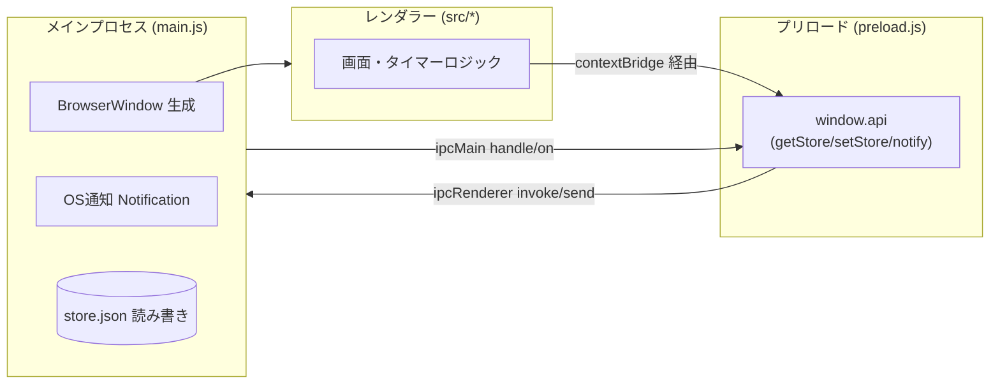
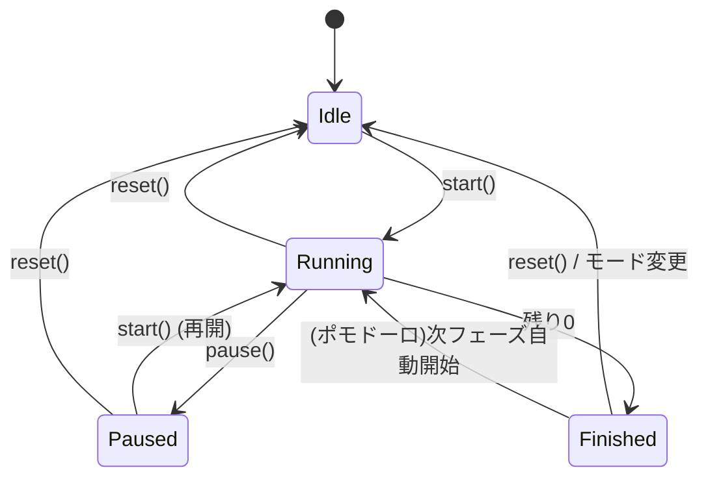
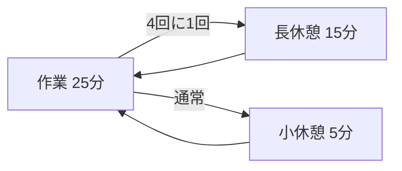

# Time & To-Do 技術設計資料

最終更新: 2026-09-14 / 対象バージョン: 0.2.0

---

## 1. 概要

タイマー機能を中心にしたデスクトップアプリ。カウントダウン・ポモドーロ・時刻指定
（目標時刻までのカウントダウン）に加え、基本的な To-Do（追加/完了/削除/永続化）を備える。
今後はタイマーと To-Do の連携などを進める。本資料は実装済みの設計と、今後の拡張方針をまとめる。

### 1.1 ゴール / 非ゴール

**ゴール**
- Windows でダブルクリック起動できる軽量なタイマーアプリ
- 残り時間が直感的に分かる視覚表現（円形リング）
- タイマーと To-Do を同一アプリ内でシームレスに扱える土台

**非ゴール（現時点）**
- クラウド同期・アカウント機能
- モバイル対応
- 複数タイマーの同時実行

---

## 2. 技術スタックと選定理由

| 項目 | 採用 | 理由 |
|---|---|---|
| ランタイム | Electron 38 | Node.js が導入済み。HTML/CSS/JS で UI を書け、OS通知・ファイル保存が容易 |
| 言語 | 素の JavaScript | 小規模のため。ビルド工程（TS/バンドラ）を挟まず保守を単純化 |
| パッケージング | electron-builder 25 | nsis インストーラーと portable exe を同時生成できる |
| 永続化 | JSON ファイル | 小さなデータ量。DB を導入せず `userData/store.json` に直接保存 |

**Tauri を採用しなかった理由**: Rust ツールチェーンが未導入で、導入コストが高いため。
将来アプリが大きくなり配布サイズ（現状 約90MB）が問題になれば再検討の余地あり。

---

## 3. アーキテクチャ

Electron の標準的な3層構成（メイン / プリロード / レンダラー）を採用し、
セキュリティのため `contextIsolation: true` / `nodeIntegration: false` とする。



### 3.1 プロセス間通信（IPC）

レンダラーは Node.js API に直接触れず、プリロードが公開する `window.api` のみを使う。

| チャンネル | 種別 | 方向 | 用途 |
|---|---|---|---|
| `store:get` | invoke/handle | R → M → R | 保存データの取得 |
| `store:set` | invoke/handle | R → M → R | 保存データの書き込み |
| `notify`    | send/on       | R → M     | OS通知の発火（title/body） |

> 現状、`store:get` / `store:set` は実装済みだがレンダラーからは未使用。
> **To-Do 機能で使う永続化レイヤーとして先行して用意している。**

---

## 4. ディレクトリ構成

```
time-todo/
├─ main.js            # メインプロセス：ウィンドウ・IPC・通知・保存
├─ preload.js         # 安全なAPIブリッジ（contextBridge）
├─ src/
│  ├─ index.html      # 画面レイアウト（タブUI）
│  ├─ renderer.js     # タイマーの状態管理とロジック
│  └─ style.css       # スタイル（円形リング含む）
├─ docs/
│  └─ DESIGN.md       # 本資料
├─ package.json       # 依存・スクリプト・electron-builder 設定
├─ README.md
├─ LICENSE            # MIT
└─ .gitignore         # node_modules / dist などを除外
```

---

## 5. タイマーの設計

### 5.1 状態モデル

レンダラーはグローバルな状態変数群で1つのタイマーを管理する。

| 変数 | 意味 |
|---|---|
| `mode` | `'countdown'` / `'pomodoro'` |
| `phase` | ポモドーロ用フェーズ `'work'` / `'short'` / `'long'` |
| `completedPomos` | 完了した作業セッション数 |
| `durationMs` | 現フェーズの総時間（リングの分母） |
| `remainingMs` | 残り時間 |
| `endTime` | 稼働中の終了時刻（`Date.now()` 基準のタイムスタンプ） |
| `ticker` | `setInterval` のID |
| `running` | 稼働中フラグ |

### 5.2 ドリフト対策（重要な設計判断）

`setInterval` の発火回数を数えて減算すると、タブ非アクティブ時などに誤差が蓄積する。
そこで **開始時に終了時刻 `endTime = Date.now() + remainingMs` を確定**し、
毎フレーム `remainingMs = endTime - Date.now()` で「今の残り」を再計算する。
`setInterval` は 200ms 間隔で「再描画のトリガー」としてのみ使い、時間の真実は常に時計から得る。

### 5.3 状態遷移



### 5.4 カウントダウン

- 入力は **時 / 分 / 秒**。上限 **12時間**（`MAX_MS = 12*60*60*1000`）を超える指定は自動で頭打ち。
- プリセット（1分〜3時間）は「秒数」を `data-sec` で持ち、入力欄へ反映してから確定する。
- 表示は1時間以上で `HH:MM:SS`、未満で `MM:SS`（`fmt()` が切替）。

### 5.4.1 時刻指定（目標時刻までのカウントダウン）

- `<input type="time">` で目標時刻(HH:MM)を指定。指定時刻が現在より前なら**翌日**として扱う。
- `applyTarget()` が目標時刻のタイムスタンプ `targetTimestamp` を算出し、
  `remainingMs = durationMs = targetTimestamp - Date.now()` を設定（総リングの基準は設定〜目標の全長）。
- `start()` では `endTime = targetTimestamp` に直接ロックし、セット〜開始間の経過も含めて
  実時刻に正確に合わせる。終了時は「指定時刻になりました」を通知。

### 5.5 ポモドーロ

- 定数 `POMO = { work:25, shortBreak:5, longBreak:15, longEvery:4 }`（分）。
- `finish()` で作業→休憩→作業…と自動巡回。作業を `longEvery`(4) 回終えるごとに長休憩。
- フェーズ切替後は `start()` を呼び、次フェーズを自動開始する。



### 5.5.1 毎正時チャイム

- ON にすると毎時 XX:00 に音（`beep`）と通知を出す（`store.chimeEnabled` に保存、起動時復元）。
- `msToNextHour()` で次の正時までの ms を求め、`setTimeout` で予約 → 発火時に再計算して連鎖
  （`setInterval` を使わずドリフトを避ける。スリープ復帰時も次回発火で再整合）。
- タイマー本体とは独立。音を確実に鳴らすため main の `webPreferences.autoplayPolicy` を
  `'no-user-gesture-required'` に設定。

### 5.6 通知（終了時）

- **音**: WebAudio で 880Hz のビープを 0.25s 間隔で3回鳴らす（`beep()`）。外部音源ファイル不要。
- **OS通知**: `window.api.notify(title, body)` → メイン側 `Notification` で発火。

---

## 6. UI 設計

### 6.1 画面構成

上部タブで「タイマー / To-Do」を切替（To-Do は現在プレースホルダ）。
タイマー画面はさらに「カウントダウン / ポモドーロ」をモード切替。

### 6.2 円形リングによる残量表現

SVG の `<circle>` 2枚（背景トラック + 進捗）で構成。半径 `r=90`。

- 円周 `C = 2πr`（`RING_C`）を `stroke-dasharray` に設定。
- 残り割合 `ratio = remainingMs / durationMs` に対し
  `stroke-dashoffset = C * (1 - ratio)` で長さを制御。
- リングは CSS で `rotate(-90deg)` し、12時方向から減っていくように見せる。
- 残り10秒で `warning` クラスを付与し、リングと数字を赤くする。

---

## 7. 永続化設計

- 保存先: `app.getPath('userData')/store.json`（OSごとのユーザーデータ領域）。
- 形式: 単一 JSON。読み込み失敗時は空オブジェクトにフォールバック（`loadStore`）。
- 書き込みは `JSON.stringify(..., null, 2)` で整形保存（`saveStore`）。
- タイマーの状態は永続化していない（起動ごとに初期化）。
- **To-Do は本レイヤーで永続化**：`store.todos` に配列 `{ id, text, done }` を保存し、起動時に読み込む
  （`loadTodos` / `saveTodos`。他の保存項目は保持したまま todos だけ更新）。

---

## 8. ビルドと配布

### 8.1 electron-builder 設定（package.json `build`）

- `appId`: `com.usizou.timetodo` / `productName`: `Time & To-Do`
- Windows ターゲット: `nsis`（インストーラー）と `portable`（単体exe）の x64
- 生成物は `dist/` に出力（Git 管理外）

```bash
npm start   # 開発起動
npm run dist # exe 生成
```

### 8.2 既知のビルド課題と対処

- **winCodeSign 展開エラー**: electron-builder が取得する `winCodeSign` 内の
  macOS 用シンボリックリンクが、Windows で管理者権限/開発者モードなしだと作成できず失敗する。
  対処として、キャッシュ
  `%LOCALAPPDATA%\electron-builder\Cache\winCodeSign\winCodeSign-2.6.0`
  に **`darwin` フォルダを除外して手動展開**し、再ビルドで回避した。
  （Windows 署名には `darwin` 配下は不要）
- **コード署名なし**: 初回起動時に SmartScreen 警告が出る。個人利用では「詳細情報→実行」で回避可。

---

## 9. セキュリティ方針

- `contextIsolation: true` / `nodeIntegration: false`：レンダラーから Node.js を直接触らせない。
- 公開APIは `preload.js` の `window.api` に限定（最小権限）。
- 外部ネットワーク通信なし。ユーザーデータはローカルの `store.json` のみ。

---

## 10. To-Do 機能

### 10.0 実装状況（基本機能・実装済み）

- タスクの追加（テキスト入力 + Enter / 追加ボタン）
- チェックボックスで完了/未完了を切替（完了時は取り消し線 + グレー表示）
- タスクの削除（✕）
- `store.todos` への永続化（起動時に復元）
- ユーザー入力は `textContent` で描画し、HTML インジェクションを防止

### 10.1 データモデル

```jsonc
// store.json
{
  "todos": [
    {
      "id": "生成ID",
      "title": "タスク名",
      "done": false,
      "createdAt": 1690000000000,
      "estimatePomodoros": 2   // 任意：想定ポモ数
    }
  ],
  "settings": { /* 将来のユーザー設定 */ }
}
```

### 10.2 実装方針

- レンダラーに To-Do 用モジュール（一覧描画・追加・完了・削除）を追加。
- 保存は既存の `window.api.getStore` / `setStore` を利用（IPC は追加不要）。
- **タイマー連携**（発展）: タスクを選んでポモドーロ開始 → 完了ごとにそのタスクの
  消化ポモ数を加算する、といった連動を想定。

### 10.3 リファクタリング候補

現在 `renderer.js` はタイマーロジックとDOM操作が同居している。To-Do 追加時に肥大化するため、
- `timer.js`（状態機械） / `todo.js` / `ui.js`（描画） への分割
- あるいは軽量フレームワーク導入
を検討する。導入判断は「複数機能が状態を共有し始めた時点」を目安とする。

---

## 11. ロードマップ（案）

| フェーズ | 内容 |
|---|---|
| 0.2.x | タイマーの微調整（音の選択、リング演出、常に最前面 など） |
| 0.3.0 | To-Do 基本機能（追加/完了/削除/永続化） |
| 0.4.0 | タイマーと To-Do の連携 |
| 0.5.0 | アプリアイコン設定、設定画面 |
| 1.0.0 | 安定版。必要に応じてコード署名・自動更新の検討 |

---

## 12. 既知の制限

- タイマーは同時に1つのみ。
- アプリ終了でタイマー状態は失われる（永続化未対応）。
- exe は未署名。配布時に警告が出る。
- 配布サイズが大きい（Electron 由来、約90MB）。
